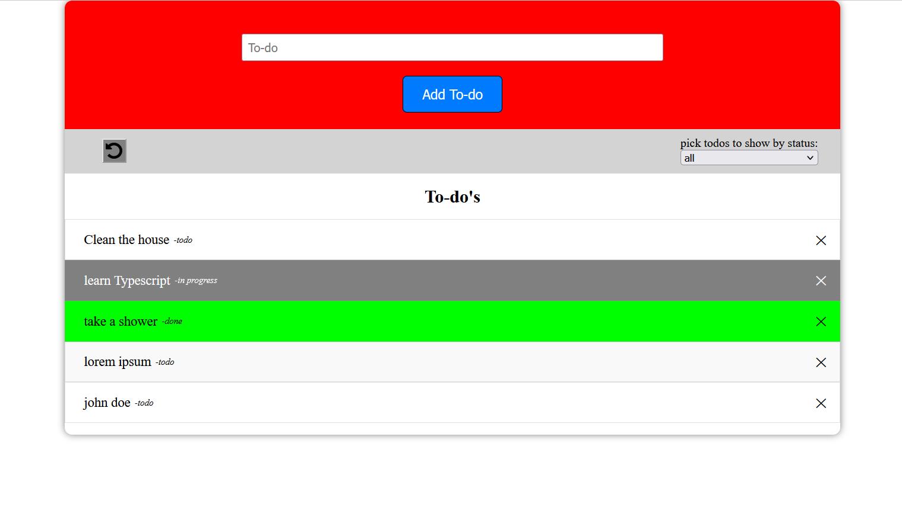
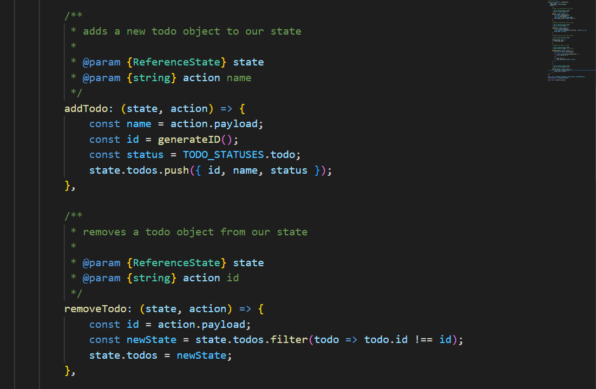

# 🚀 To-do App
A simple To-do app where you can add new To-do's, delete old ones, and change the status of the To-do's by clicking on them



# ⚡ About
I created this app to be able to showcase my programming skills, the code in the file is both clean and well-documented using JSDoc



# 🛑 Built on
* React 18.2.0
* Redux 8.0.4
* Redux toolkit 1.8.5
* Styled components 5.3.5

# 💻 Development
1. clone the repository
```
$ git clone https://github.com/DanijelAdrinek/todo-app.git
```

2. install dependencies
```
$ npm install
```

3. run app
```
$ npm start
```